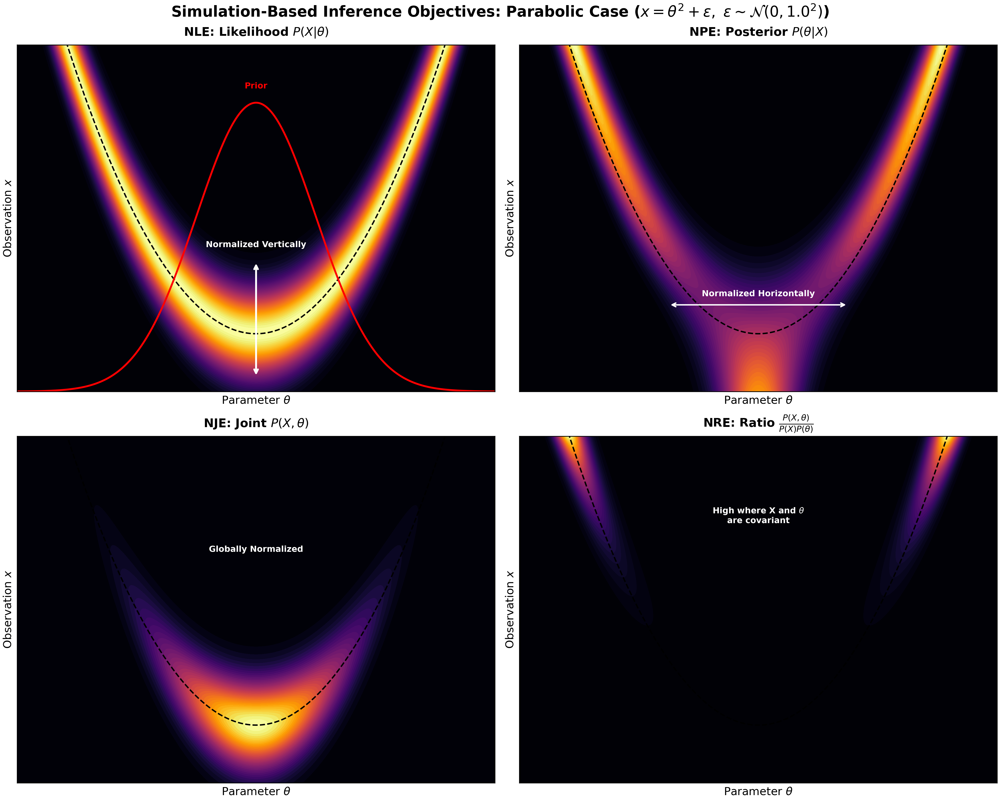
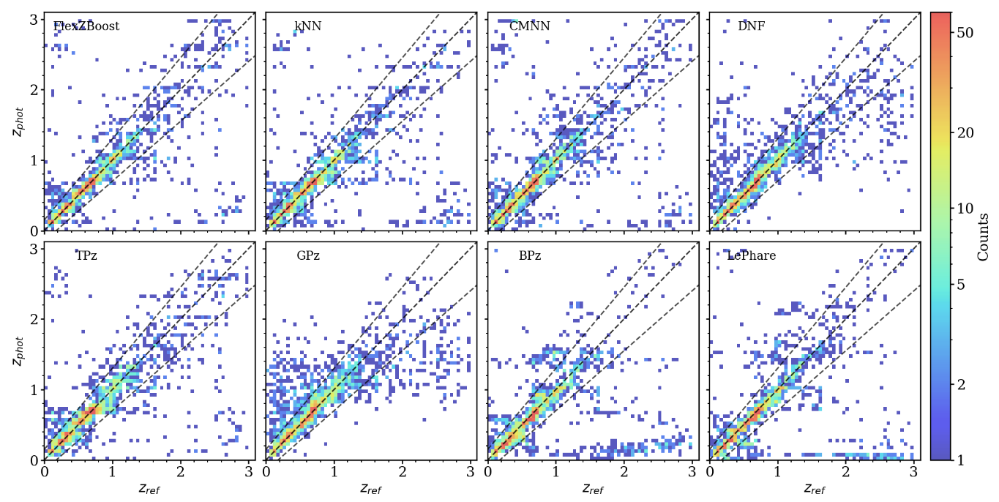

# Simulation-Based-Inference

## Setup

Simulation Based Inference (SBI) is what it says on the box, attempting to infer something about the world primarily through simulations. 
It is also sometimes called Likelihood Free Inference (LFI) though this is somewhat misleading, since we do have access to the likelihood just not the density, a sampler is an expression of the likelihood though in a somewhat inconvenient format.

Ok, lets be more specific, our goal is to infer a posterior probability distribution $P(\theta | X)$ over parameters given some data where $\theta$ is the parameters and $X$ is the data.
Typically, what we have access to is actually a prior $P(\theta)$ over the parameters (if you think you don't have this, I assure you that you do) and a likelihood $P(X | \theta)$.
Those two parts should describe how our data came about through a two step process:

1. Sample parameters $\theta_i \sim P(\theta)$
1. Sample the data $X_i \sim P(X | \theta_i)$

The goal of SBI is to infer the posterior on $\theta$ given some data $X$ and the two sampling functions above, under the restriction that we can't evaluate the probability densities of those functions.

## The three approaches

There are broadly three approaches to SBI used in the community: Neural Ratio Estimation (NRE), Neural Likelihood Estimation (NLE), and Neural Posterior Estimation (NPE).
Though I would prefer to just call them: Ratio Estimation, Likelihood Estimation, and Posterior Estimation, since the "Neural" part is just a implementation detail and would be dropped tomorrow if we found something better than neural networks for the task.

In Figure 1 we plot the three different objectives of these SBI approaches.

- The most direct is the NPE (right) which simply fits a posterior density function so that one can later enter their data $X$ and get a probability density function (PDF) for the parameters of interest.
Note that having $P(\theta | X)$ can sometimes be only half the battle, if $\theta$ has many dimensions then even if we can evaluate it, we still will need to do some work to get marginal distributions.
In fact for anything but a 1D or 2D parameter space, one would likely have to run MCMC sampling on the PDF to get the marginals.
- The NRE (left) approach has some nice features, it can be easier to train (its just a classifier, see below), we can also get the evidence $P(X)$ in some cases (e.g. when the SBI method is a mixture of Gaussians).
- The third option NLE (center) has some key advantages in that it is independent of the prior, and often (though not always) relatively simple compared to the others.
In our example the likelihood may look bent, but keep in mind that the $\theta$ values are given, so all we need to learn is the parabola $\theta^2$ and a Gaussian with sigma of $2.0$.

*Figure 1: Comparison of the different SBI target distributions. Here we see the interplay of the likelihood, prior, and different normalization directions in a very simple inference task.*

Both the NRE and NPE have some drawbacks, namely that they bake the prior into their distribution so it is not possible (specifically it is not numerically stable) to change up the prior after the fact, a new SBI model would need to be trained for a new prior.
Another issue is that the joint (NRE) and posterior (NPE) distributions can be quite complex, in our example in Figure 1 the joint distribution is bent strongly and the posterior is bimodal.

## Example

There are some great examples of SBI being used in astronomy.
[This paper](https://ui.adsabs.harvard.edu/abs/2019MNRAS.488.4440A/abstract) provides a nice overview of techniques, as well as some very simplified examples.

I feel compelled to comment again that the "Neural" part of NRE, NPE, NLE is not always (in fact perhaps often not) needed.
Consider the example of photometric redshift estimation as discussed in the [RAIL paper](https://ui.adsabs.harvard.edu/abs/2025arXiv251007370Z/abstract).
It is trivial to determine the redshift of a galaxy from a high resolution, high signal-to-noise spectrum, but often all we get is a few wide integrated bands (photometry).
Trying to estimate these photometric redshifts is hard but not impossible, and we can see in Figure 2 that it broadly works well for a variety of algorithms.

*Figure 2: comparison of multiple photometric redshift estimation algorithms. Estimated redshift (y-axis) versus reference redshift (x-axis). Reference: This is Figure 4 in [Zhang et al. 2025](https://ui.adsabs.harvard.edu/abs/2025arXiv251007370Z/abstract)*

While the relations in Figure 2 are quite tight, there is clearly notable scatter for all of them that is significantly away from the 1:1 line.
This is a cause of great consternation in the photo-z community, with many discussions on "de-biasing" the predictions.
Though talk of de-biasing is perhaps focusing too much on the first moment of the data, when there is much more going on.
Even if we could de-bias the mean prediction, clearly there isn't a simple Gaussian scatter that could describe the uncertainty on the photometric redshifts.
But that's ok, we can use the concepts from SBI!
These 2D histograms essentially provide the ~~N~~LE or ~~N~~PE depending on how you normalize it.
You would probably want to get a lot more examples, or apply some smoothing, but trying to use a Neural network is like using a cement mixer to make bread (certainly overkill, and probably not very good in the end anyway).

## Some math

Ok, so we don't **always** need a neural network, but sometimes we do, so how does that work?
The NRE's are a bit different, so we'll start with NPE and NLE which are largely the same.
Let's think of our NLE (just switch $X$ and $\theta$ for NPE) as a probability density $P(X | \theta, w)$ where $w$ are the network weights.
Our target is the true $P(X | \theta)$ PDF, which we can enforce using the Kullback–Leibler divergence:

$$D_{KL} = \int P(X_i|\theta)\ln\left(\frac{P(X_i|\theta,w)}{P(X_i|\theta)}\right)dX_i$$

Which would be a nasty integral to solve directly, but we can do a good job with a Monte-Carlo estimate of the integral.
To Monte-Carlo an integral, we sample from one component ($P(X_i | \theta)$) and evaluate the other component:

$$D_{KL} \approx \frac{1}{N}\sum_{X_i\sim P(X_i|\theta)}\ln\left(\frac{P(X_i|\theta,w)}{P(X_i|\theta)}\right)$$

Note that the sum is over samples $X_i\sim P(X_i|\theta)$ which is great!
Since we are allowed to sample $P(X|\theta)$ we just can't evaluate its density.
But the $P(X_i|\theta)$ density still appears as a ratio in the log function, oh no!
Luckily, we don't actually need to know the KL-divergence, we just need to get the network to minimize the KL-divergence.
If we take the gradient $\nabla_{w}D_{KL}$ then the dependence on the true likelihood goes away!
So it is possible to minimize the KL divergence without ever directly evaluating it (wild), and this is actually a pretty powerful observation used elsewhere in machine learning too.

The NRE method works a bit differently, for this you train a classifier.
The classifier learns to distinguish $\{\theta, X\}$ pairs that were simulated together (the two step process at the top) vs random $\{\theta', X'\}$ marginal pairs (just pulled from a large collection).
If you use the binary cross entropy loss then the classifier learns the ratio 

$$r(\theta, X) = \frac{P(\theta, X)}{P(\theta)P(X)}$$

So I kind of cheated in Figure 1, the target for NRE isn't really $P(\theta, X)$ its $r(\theta, X)$, but for conceptual purposes it is useful to think that way.
To get the posterior, it turns out that $r(\theta, X)P(\theta)$ is all you need!
Alternately, one could use the KL-divergence technique to learn $P(\theta, X)$, but as I understand this can be tricky since it will be a large parameter space ($\theta$ dimensions and $X$ dimensions) to learn over, and crucially to normalize over.